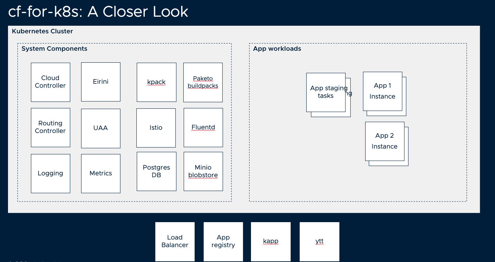

# cf push comes to Kubernetes

Cloud Foundry For Kubernetes (cf-for-k8s) blends the popular CF developer API with Kubernetes, Istio, and other open source technologies. The project aims to improve developer productivity for organizations using Kubernetes. cf-for-k8s can be installed atop any conformant environment in minutes.

Cloud Foundry is an open-source cloud platform as a service (PaaS) on which developers can build, deploy, run and scale applications. For more information on what Cloud Foundry is and how it can help developers build cloud native applications and platform operators to manage those apps at scale, please visit [cloudfoundry.org](https://cloudfoundry.org) and [docs.cloudfoundry.org](https://docs.cloudfoundry.org/)

## Getting Started
If you're new to Kubernetes, we recommend this [Getting Started Guide](docs/getting-started-tutorial.md), which walks you though deploying cf-for-k8s on your machine using a local [kind](https://kind.sigs.k8s.io/) (Kubernetes In Docker) cluster.  The guide configures your cf-for-k8s deployment as a developer-edition that runs on your laptop and can handle approximately 10 small applications.  

For more generic and flexible instructions, see [Deploying CF for K8s](docs/deploy.md).

## Contributing
Please read [CONTRIBUTING.md](community/CONTRIBUTING.md) for details on the process for submitting pull requests to us.

## Built with

cf-for-k8s is built on top of well known Kubernetes projects like:

- [istio](https://github.com/istio/istio)
- [envoy](https://github.com/envoyproxy/envoy) 
- [fluentd](https://www.fluentd.org/)
- [eirini](https://www.cloudfoundry.org/project-eirini/)
- [kpack](https://github.com/pivotal/kpack)
- [paketo buildpacks](https://paketo.io)

as well as some Cloud Foundry projects that have undergone a containerization effort such as:

- [CF API / CAPI-k8s-release](https://github.com/cloudfoundry/capi-k8s-release)
- [cf-k8s-networking](https://github.com/cloudfoundry/cf-k8s-networking)
- [cf-k8s-logging](https://github.com/cloudfoundry/cf-k8s-logging)
- [UAA](https://github.com/cloudfoundry/uaa)

## Versioning

We use [SemVer](https://semver.org/) for versioning. For the versions available, see the [releases](https://github.com/cloudfoundry/cf-for-k8s/releases) on this repository.

- TODO: provide documentation for explaining our semantic versioning

## Maintainers

See the list of [MAINTAINERS](community/MAINTAINERS.md) and their contact info.

## License

This project is licensed under the APACHE LICENSE-2.0 - see the [LICENSE.md](LICENSE) file for details.

## CI Pipelines

This project includes a test suite that makes use of Concourse pipelines, which can be found [here](https://release-integration.ci.cf-app.com).

## Have a question or feedback, reach out to us

We are very active in slack channel [#cf-for-k8s](https://cloudfoundry.slack.com/archives/CH9LF6V1P) in the Cloud Foundry workspace. Please hit us up with any questions you may have or to share your experience with the cf-for-k8s community. To request a fast reponse during Pacific business hours, begin your message with `#release-integration @interrupt`
