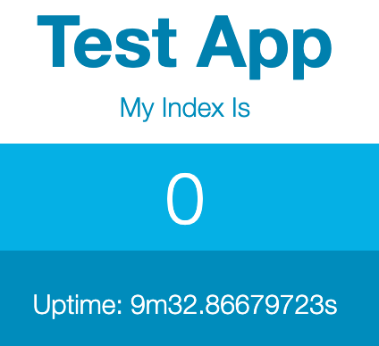

# Getting Started with Cf-for-K8s

This tutorial guides you through your first `cf push` experience.

In order to get there you first need to deploy cf-for-k8s. The platform that provides the developer experience on top of Kubernetes. So, let’s get started.

## Pre-requisites

### Machine requirements
This tutorial will guide you through installing a local kubernetes cluster with the following machine requirements, see that your computer can handle them:

- have a minimum of 1 node
- have a minimum of 4 CPU, 6GB memory per node (preferably 6+ CPU and 8+ GB memory)

### Tooling

You’ll also need a few CLIs before you start:

- [kind](https://kind.sigs.k8s.io/docs/user/quick-start/), the CNCF project for creating kubernetes clusters locally
- [ytt](https://carvel.dev/#install), the cli used to render kubernetes templates
- [kapp](https://carvel.dev/#install), the cli used to deploy cf-for-k8s
- [yq](https://github.com/mikefarah/yq); a cli tool for extracting information from yaml documents
- [git](https://git-scm.com/book/en/v2/Getting-Started-Installing-Git); the tool we use to interact with the cf-for-k8s repository
- a [Dockerhub](https://hub.docker.com) account; cf-for-k8s will use this account to store your application images
- [cf](https://docs.cloudfoundry.org/cf-cli/install-go-cli.html), the cli used to interact with Cloud Foundry 

## Installing Cf-for-K8s

First things first, git clone the cf-for-k8s repository. This repository contains our templated k8s yaml files:

```
git clone https://github.com/cloudfoundry/cf-for-k8s.git -b main
cd cf-for-k8s
TMP_DIR=<your-tmp-dir-path>; mkdir -p ${TMP_DIR}
```

Note: if you would like to use the latest release, replace the branch reference in the clone command with that release tag. (E.G. `-b v1.0.0`)

Next, create the local kubernetes cluster that we will deploy cf-for-k8s to presently:

```
kind create cluster --config=./deploy/kind/cluster.yml --image kindest/node:v1.19.1
```
NOTE: the versions of kubernetes that cf-for-k8s supports are [here](https://github.com/cloudfoundry/cf-for-k8s/blob/master/supported_k8s_versions.yml).

Create your cf values file. This is the file that configures your deployment:

```
$ ./hack/generate-values.sh -d vcap.me > ${TMP_DIR}/cf-values.yml
$ cat << EOF >> ${TMP_DIR}/cf-values.yml
app_registry:
  hostname: https://index.docker.io/v1/		
  repository_prefix: "<my_username>"	
  username: "<my_username>"
  password: "<my_password>"

add_metrics_server_components: true			
enable_automount_service_account_token: true
load_balancer:
  enable: false
metrics_server_prefer_internal_kubelet_address: true
remove_resource_requirements: true
use_first_party_jwt_tokens: true
EOF
```
NOTES:
1. You must supply an OCI-compliant container registry. Dockerhub is recommended.
2. The additional properties configure your cf-for-k8s to run on a local kind cluster.

With our input values configured we are now ready to deploy cf-for-k8s:

```
$ kapp deploy -a cf -f <(ytt -f config -f ${TMP_DIR}/cf-values.yml)
```

Running this command should take about 10 minutes or less. `kapp` will provide updates as it progresses:

```
...
4:08:19PM: ---- waiting on 1 changes [0/1 done] ----
4:08:19PM: ok: reconcile serviceaccount/cc-kpack-registry-service-account (v1) namespace: cf-workloads-staging
4:08:19PM: ---- waiting complete [5/10 done] ----
...
```

When deployment has finished you can log into Cloud Foundry:

```
$ cf api api.vcap.me --skip-ssl-validation
$ cf auth admin `cat ${TMP_DIR}/cf-values.yml | yq -r .cf_admin_password`
```

## Experiencing your first `cf push`

Before we can push an application we need to create an organization and space for your application to exist in. 

NOTE: Cloud Foundry supports the development workflows of very large organizations, you can read more about 
how Cloud Foundry achieves that [here](https://docs.cloudfoundry.org/concepts/roles.html).

```
$ cf create-org my-org
$ cf create-space my-space -o my-org 
$ cf target -o my-org -s my-space
```

Now, we are ready to push our first app:

```
$ cd ..
$ git clone https://github.com/cloudfoundry-samples/test-app.git
$ cd test-app
$ cf push test-app
```

You will notice that what we pushed is source code. Yet Kubernetes runs containers. Just some of the magic of Cloud Foundry is is that it can perform the staging and deployment of your application. Leaving you to concentrate on your code. 

Once deployed, open your browser and visit test-app.vcap.me:



Congratulations. You just pushed your first application to CloudFoundry. As the tagline says “Here is my source code. Run it on the cloud for me. I do not care how.”
