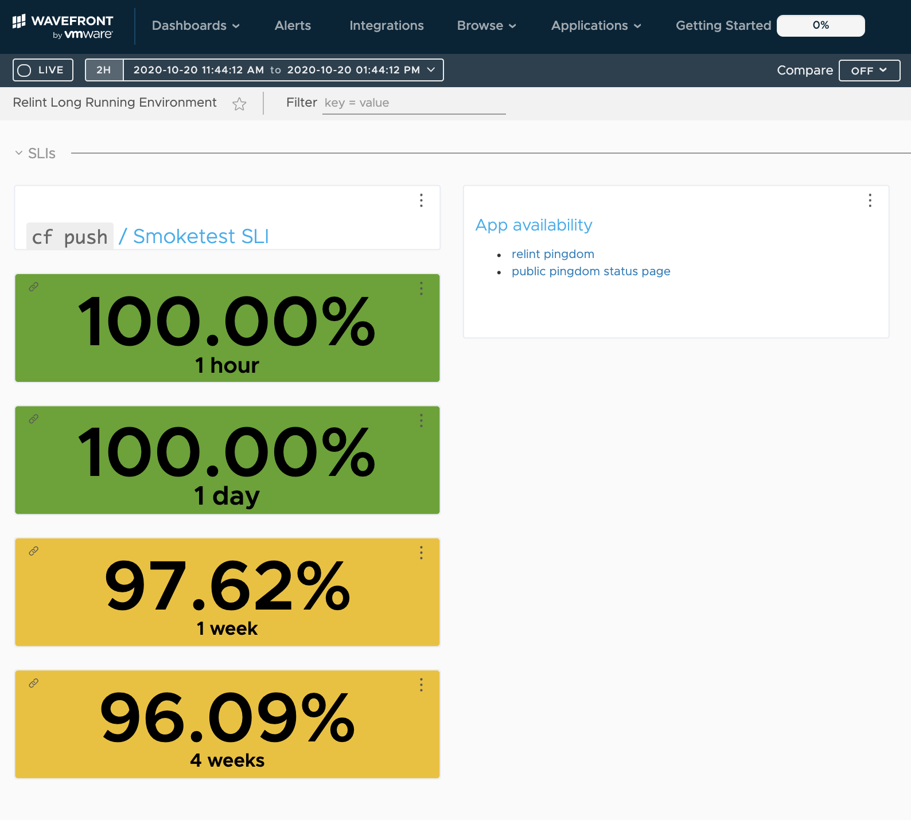

# Application and Control Plane Availability

## Availability during normal operation

As we approach feature parity with cf-deployment, we're targetting an app availability SLO of 99.9% and a control plane (ie `cf push`) SLO of 99.5%.

We've been measuring cf-for-k8s platform availability using a long-running environment, which gets upgraded each night to the latest commit of `main`. The pipeline for managing this environment lives in this repository here: [cf-for-k8s-stability-tests.yml](ci/pipelines/cf-for-k8s-stability-tests.yml)

The app availability measurement is captured via [Pingdom](https://www.pingdom.com/) and checks a simple app that is `cf push`ed upon creation of the long-running environment. The availability data is publically available here: http://stats.pingdom.com/vif3j4a46q0w/6350471

For the two months leading up to the v1.0.0 release, the app availability was 99.90% and 99.95%, respectively.

We also collect a [smoke test](tests/smoke/smoke_test.go) / `cf push` SLI using this same environment. We have a Concourse job that runs constantly [here](https://release-integration.ci.cf-app.com/teams/main/pipelines/cf-for-k8s-stability-tests/jobs/long-lived-env-sli), that tests cf-for-k8s smoke tests and emits metrics to [VMware Tanzu Observability by Wavefront](https://tanzu.vmware.com/observability) and our associated [currently private] dashboard.

For the 4 weeks leading up to the v1.0.0 release, the smoke test SLI has been just over 96%. Here's a snapshot of the currently private dashboard:

## Availability during platform upgrades

Note: typical cf-for-k8s platform upgrades take only a couple of minutes (frequently taking only a matter of seconds).

Up to this point in the project, most app availabilty downtime during upgrades has been associated with networking updates. Specifically, we've seen that app downtime correlates with istio ingress gateways restarting.

We have not yet investigated or aggregated common root causes of control plane downtime.

For post v1.0.0 releases, we'll include downtime information in release notes. From pre-v1.0.0, this document captures downtime-causing changes and lives [here](https://docs.google.com/spreadsheets/d/1eJEOJg7WLqL8n_S-woKAMYGunh9jyhI0sFMScmxi9F4/edit#gid=0).
