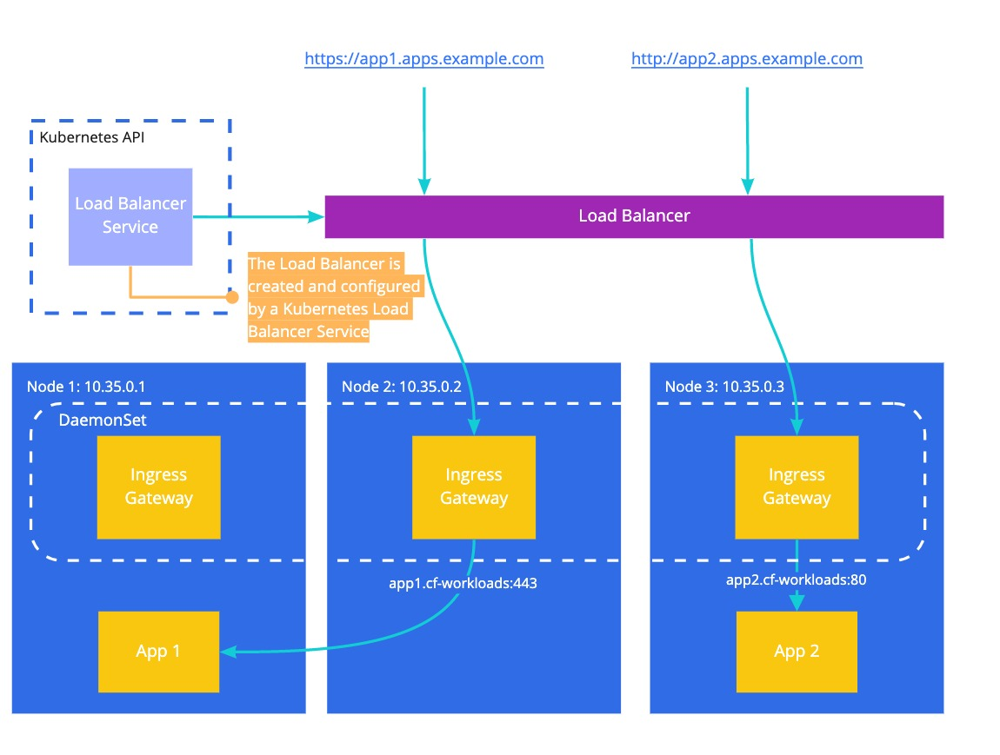
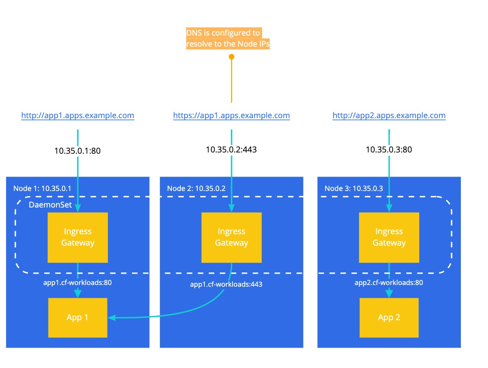
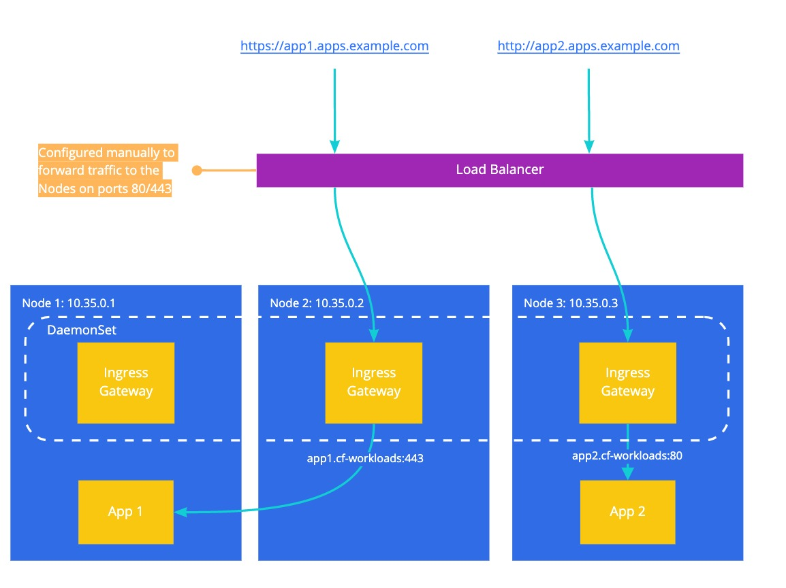

# Ingress Routing with Ingress Gateway as a Daemon Set

The Istio Ingress Gateway is deployed as a Kubernetes Daemon Set with every
Ingress Gateway directly listening on ports 80 and 443. This allows a variety of
ways to route to the Ingress Gateway.

### Routing with Load Balancer Service

On cloud providers that support external load balancers, a typical production
installation will use a [LoadBalancer
Service](https://kubernetes.io/docs/concepts/services-networking/service/#loadbalancer)
to allow traffic to reach the Istio Ingress Gateway.

### Routing directly to Worker Nodes

For non-production use cases (e.g. demos or testing), it can be useful to not
require a load balancer and instead have DNS (or client-side /etc/hosts) resolve
directly to the IP(s) of Kubernetes workers.

As an example, let's consider a Kubernetes cluster with three worker nodes.
These workers are reachable at `10.35.0.1`, `10.35.0.2`, and
`10.35.0.3`. DNS has been configured to map `*.apps.example.com` to these three
IP addresses.

The following diagram shows what this might look like:

### Routing with an external configured Load Balancer

An alternative to using a Kubernetes Load Balancer service to manage your
infrastructure Load Balancer is to use an externally configured Load Balancer.
This is valuable on infrastructures that don't support the Kubernetes Load
Balancer Service. The external Load Balancer would be configured to receive and
forward traffic to the Kubernetes Worker nodes on ports 80 and 443.

