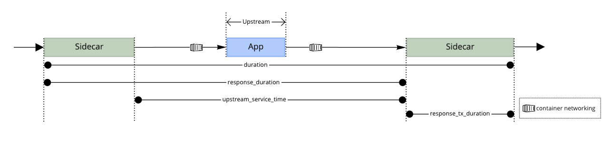

## Access Logs

### How to view access logs?

Traffic flows through the sidecar containers on sidecar enabled pods, which
prints access logs to stdout. For example, this is how you might view them for your apps:

```
kubectl logs app-pod -c istio-proxy -n cf-workloads
```

Any namespace with the label `istio-injection=enabled` will add a sidecar
`istio-proxy` container to all pods in the namespace. You can try the above
command for any pod in a namespace with the label `istio-injection=enabled`.

### Example access log line

```json
{
  "app_id": "e96aef43-873a-46db-8d3e-4bc6acd70da9",
  "authority": "myapp.apps.com",
  "bytes_received": "0"
  "bytes_sent": "9593",
  "downstream_local_address": "10.52.5.11:8080",
  "downstream_remote_address": "34.123.54.126:0",
  "duration": "22",
  "method": "GET",
  "organization_id": "d390d3f0-f349-481a-8f13-8f1f76ab12ed",
  "path": "/",
  "process_type": "-",
  "protocol": "HTTP/1.1",
  "referer": "-",
  "request_id": "0e5e3948-e8bf-4668-8275-5b87eadcd983",
  "requested_server_name": "outbound_.8080_._.s-93d15c95-b5c3-45e0-bb16-26172767b322.cf-workloads.svc.cluster.local",
  "response_code": "200",
  "response_duration": "22",
  "response_flags": "-",
  "response_tx_duration": "0",
  "space_id": "471a8af4-3627-4324-bca9-3f69b2e80ab2",
  "start_time": "2020-09-10T20:45:01.808Z",
  "upstream_cluster": "inbound|8080|http|s-93d15c95-b5c3-45e0-bb16-26172767b322.cf-workloads.svc.cluster.local",
  "upstream_host": "127.0.0.1:8080",
  "upstream_local_address": "127.0.0.1:53338",
  "upstream_service_time": "21",
  "upstream_transport_failure_reason": "-",
  "user_agent": "curl/7.68.0",
  "x_b3_parentspanid": "7cbd7a861229cc6a",
  "x_b3_spanid": "a8ba1d9c16d7437c",
  "x_b3_traceid": "efff41366f43d46c7cbd7a861229cc6a",
  "x_forwarded_for": "34.123.54.126",
  "x_forwarded_proto": "https",
}
```

### Duration fields

The access log contains the following fields for duration in milliseconds

- `upstream_service_time`: The time from when the sidecar sends a request to the app to when it receives a response from the app
- `duration`: The time from when the sidecar receives a request from the gateway to when it sends a response to the gateway
- `response_duration`: The time from when the sidecar receives a request from the gateway to when it receives a response from the app
- `response_tx_duration`: The time a response spends in the sidecar



#### Determining App Latency vs Platform Latency
To calculate the time a request spends within the sidecar subtract `upstream_service_time` from `response_duration`

### Fields

The fields we use are defined by [Envoy's access logging
format](https://www.envoyproxy.io/docs/envoy/latest/configuration/observability/access_log/usage).

* `app_id`: Cloud Foundry application GUID
* `authority`: `Authority` (HTTP/2) or `Host` header (HTTP/1.1) of the request;
  see [RFC7540](https://tools.ietf.org/html/rfc7540#section-8.1.2.3) for more
  details
* `bytes_received`: Body bytes received
* `bytes_sent`: Body bytes sent. For WebSocket connections it will also include
  response header bytes
* `downstream_local_address`: Local address of the downstream connection; see
  `%DOWNSTREAM_LOCAL_ADDRESS%` in Envoy docs
* `downstream_remote_address`: Remote address of the downstream connection; see
  `%DOWNSTREAM_REMOTE_ADDRESS%` in Envoy docs
* `duration`: Total duration in milliseconds of the request from the start time
  to the last byte out; see `%DURATION%` in Envoy docs
* `method`: Method of HTTP request
* `organization_id`:  Cloud Foundry organization GUID of the application
* `path`: HTTP request path
* `process_type`: [Cloud Foundry Process
  Type](https://v3-apidocs.cloudfoundry.org/version/3.80.0/index.html#processes)
  for the backend being routed to
* `protocol`: Currently either HTTP/1.1 or HTTP/2. See `%PROTOCOL%` in Envoy
  docs
* `referer`: HTTP `Referer` header
* `request_id`: Unique ID for the request
* `requested_server_name`: String value set on ssl connection socket for Server
  Name Indication (SNI); see `%REQUESTED_SERVER_NAME%` in Envoy docs
* `response_code`: HTTP response code. Note that a response code of ‘0’ means
  that the server never sent the beginning of a response. This generally means
  that the (downstream) client disconnected; see `%RESPONSE_CODE%` in Envoy docs
* `response_duration`: Total duration in milliseconds of the request from the
  start time to the first byte read from the app; see `%RESPONSE_DURATION%`
  in Envoy docs
* `response_flags`: Additional details about the response or connection, if any;
  see `%RESPONSE_FLAGS%` in [Envoy docs](https://www.envoyproxy.io/docs/envoy/latest/configuration/observability/access_log/usage)
* `response_tx_duration`: Total duration in milliseconds of the request from the
  first byte read from the app to the last byte sent downstream; see
  `%RESPONSE_TX_DURATION%` in Envoy docs
* `space_id`: Cloud Foundry space GUID of the application
* `start_time`: Request start time including milliseconds; see `%START_TIME%` in Envoy docs
* `upstream_cluster`: Upstream cluster to which the upstream host belongs to
* `upstream_host`: Upstream host URL
* `upstream_local_address`: Local address of the upstream connection. If the
  address is an IP address it includes both address and port; see
  `%UPSTREAM_LOCAL_ADDRESS%` in Envoy docs
* `upstream_service_time`: Time in milliseconds spent by the app processing
  the request including network latency.; see [Duration Fields](#duration-fields) and these [Envoy
  docs](https://www.envoyproxy.io/docs/envoy/latest/configuration/http/http_filters/router_filter#x-envoy-upstream-service-time)
  for more information
* `upstream_transport_failure_reason`: If upstream connection failed due to a TLS failure. This field currently does not indicate any [Transport Layer](https://osi-model.com/transport-layer/) failures. 
  transport socket (e.g. TLS handshake), provides the failure reason from the
  transport socket
* `user_agent`: HTTP request `User-Agent` header
* `x_b3_parentspanid`: Used for request tracing; see
  [b3-propagation](https://github.com/openzipkin/b3-propagation) for more info
* `x_b3_spanid`: Used for request tracing; see
  [b3-propagation](https://github.com/openzipkin/b3-propagation) for more info
* `x_b3_traceid`: Used for request tracing; see
  [b3-propagation](https://github.com/openzipkin/b3-propagation) for more info
* `x_forwarded_for`: IP of the client used to initiate the request
* `x_forwarded_proto`: Protocol a client used to initiate the request. Can be
  `http` or `https` for HTTP traffic
